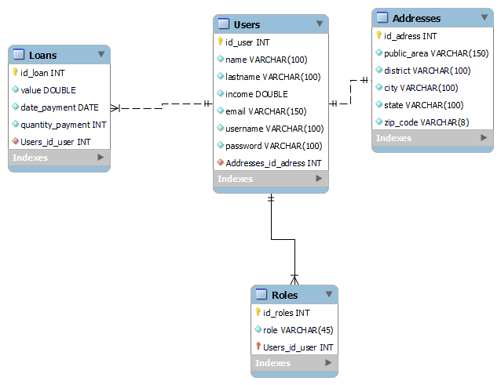

<p align="center">
  <a href="https://www.tqi.com.br">
    
  </a>
</p>

*Back-end* desenvolvido para o **TQI Evolution 2022**, onde foi possivel obter mais conhecimentos na Autenticação de usuarios usando o *Json Web Token*.

## Objetivos
Uma empresa de empréstimo precisa criar um sistema de análise de crédito para fornecer aos seus clientes as seguintes funcionalidades:
1. **Cadastro de clientes:** O cliente pode cadastrar: **nome**, **e-mail**, **CPF**, **RG**, **endereço completo**, **renda** e **senha**.
2. **Login:** A autenticação será realizada por **e-mail** e **senha**.
3. **Solicitação de empréstimo:** Para solicitar um empréstimo, precisamos do **valor do empréstimo**, **data da primeira parcela** e **quantidade de parcelas**. O **máximo de parcelas será 60** e a **data da primeira parcela deve ser no máximo 3 meses após o dia atual**.
4. **Acompanhamento das solicitações de empréstimo:** O cliente pode **visualizar a lista de empréstimos solicitados por ele mesmo** e também os **detalhes de um de seus empréstimos**. Na **listagem**, devemos retornar no **mínimo o código do empréstimo**, o **valor** e a **quantidade de parcelas**. No **detalhe do empréstimo**, devemos retornar: **código do empréstimo**, **valor**, **quantidade de parcelas**, **data da primeira parcela**, **e-mail do cliente** e **renda do cliente**.

## Funcionalidades
|        Nome          |    Descrição                                                                                                         |
|----------------------|----------------------------------------------------------------------------------------------------------------------|
| Cadastro de Usuario  | Deve ser possivel cadastrar um usuario usando: email, nome, endereço completo, RG, CPF e senha                        | 
| Login                | O usuario deve conseguir logar usando: email e senha                                                                 |
| Solicitação de Empréstimos    | O usuario deve conseguir pedir empréstimos fornecendo o valor do empréstimos, data da primeira parcela e quantidade de parcelas |
| Listar Empréstimos   | Deve ser possivel listar os empréstimos que foram solicitados pelo usuario antes autenticado  |             
| Detalhar Empréstimos | Deve ser possivel detalhar determinado empréstimo                                                                   |  

## Rotas
|      Método      |  Rota                           |
|------------------|---------------------------------|
| `POST`           | `/api/v1/signUp`                |
| `POST`           | `/api/v1/signIn`                |
| `GET`            | `/api/v1/me`                    |
| `POST`           | `/api/v1/loans`                 |
| `GET`            | `/api/v1/loans`                 |
| `GET`            | `/api/v1/loans/{id}`            |
## Banco de dados
**Sistema de Gerenciamento de Banco de Dados:** PostgreSQL 

No [**Heroku**](https://heroku.com) foi criado um novo aplicativo, onde o *Add-On* instalado é o **PostgreSQL**. Apesar de não ser possivel renomear o nome do banco de dados criado pelo **Heroku**, esta forma permite que seja feito o deploy da aplicação usando o **PostgreSQL** como banco de dados.

Como boa prática, as credenciais do banco de dados foram definidas em variaveis de ambiente:
```yaml
datasource:
    driver-class-name: org.postgresql.Driver
    url: ${DATABASE_URI}
    username: ${DATABASE_USERNAME}
    password: ${DATABASE_PASSWORD}
```

Para testar o banco de dados e realizar consulta para saber se os dados estavam sendo salvos foi usado a extensão **Database Client** no **Visual Studio** do qual permite se conectar ao **MySQL**, **PostgreSQL**, **SQL Server**, **MongoDB**, **Sqlite**, **Redis** e **ElasticSearch**.

### Tabelas
Como as entidades são o reflexo das tabelas no banco de dados. Foi buscado usar um *Object-Relational Mapping* - ORM, se norteando através do diagrama abaixo:


Embora no diagrama tenha quatro tabelas, no projeto é possivel ver apenas três entidades, sendo elas: '*Address*', '*Loan*' e '*User*', enquanto que a tabela '*Roles*' será apenas um atributo do tipo `List<String>` na entidade '*User*', no qual o ORM - com base nas anotações, irá entender que a um tabela de papeis do sistema deverá ser criada para receber um lista de dados:
```java
@ElementCollection(fetch = FetchType.EAGER)
@CollectionTable(name = "users_roles", joinColumns = @JoinColumn(name = "user_id"))
@Column(name = "roles_id")
private List<String> roles;
```

### Repositorio
Como alternativa ao padrão *Data Access Object* neste projeto foi usado o padrão *Repository*, porém não pense que não foi preciso escrever *queries*.

Para encontrar o usuario pelo email ou pelo seu username, foi escrito duas *queries* usando a linguagem entendida pelo **JPA** que retornam a entidade *User*.
```java
@Query("SELECT e FROM User e JOIN FETCH e.roles WHERE e.username = (:username)")
    public User findByUsername(@Param("username") String username);

    @Query("SELECT e FROM User e JOIN FETCH e.roles WHERE e.email = (:email)")
    public User findByEmail(@Param("email") String email);
```
Por esse motivo é possivel logar usando o email ou o username cadastrado na rota `/api/v1/users/signup`

Outras duas **queries** escritas usaram o SQL entendido pelo **PostgreSQL** e na anotação `@Query` foi definido que seria uma **query* nativa.
```java
@Query(value = "SELECT * FROM loans l, users u WHERE l.user_id = :userId AND u.id_user = :userId", nativeQuery = true)
    public List<Loans> listLoans(@Param("userId") Long userId);

    @Query(value = "SELECT * FROM loans l, users u WHERE l.id_loan = :id AND l.user_id = :userId AND u.id_user = :userId", nativeQuery = true)
    public Loans detailLoan(@Param("id") Long id, @Param("userId") Long userId);
```
Contudo, o objeto retornado por essas *queries* são chamado `ResultSet` e são precisam ser convertidos em listas ou alguma outra coleção antes de ser apresentado em `JSON`. Como atalho, foi escrito uma [interface que obtém as colunas retornadas e permite apresentar em `JSON`](https://stackoverflow.com/questions/49500309/spring-jpa-native-query-with-projection-gives-converternotfoundexception).
```java
public interface Loans {
    Long getid_loan();
    Long getuser_id();
    LocalDate getdate_payment();
    Integer getpayment_quantity();
    Double getvalue();
    String getusername();
    String getemail();
    String getname_surname_lastname();
    String getcpf();
    String getrg();
    Double getincome();
}
``` 

## Regras de Négocios
Este desafio possui algumas regras de négocios, como foi descrito nos **Objetivos**. A primeira delas é limitar o numero de parcelas em sessenta vezes. 

```java
//service/LoansService.java
if(loanDTO.getPaymentQuantity() > 60)
        {
            throw new IsMoreThanSixtyException(loanDTO.getPaymentQuantity());
        }
```
Para isso foi criado uma exceção chamada `IsMoreThanSixtyException`, no qual retorna `BAD_REQUEST` quando o usuario insere mais do que sessenta para a quantidade de pagamento.
```java
//exception/IsMoreThanSixtyException
package br.com.tqi.loanapi.exception;

import org.springframework.http.HttpStatus;
import org.springframework.web.bind.annotation.ResponseStatus;

@ResponseStatus(HttpStatus.BAD_REQUEST)
public class IsMoreThanSixtyException extends Exception {

    public IsMoreThanSixtyException(Integer quantityPayment) {
        super("Mais do que 60 parcelas eu não faço");
    }
}
```
Exceções parecidas com esta foram feitas para as outras regras de negocio. 

A outra regra de négocios pedida foi permitir que o usuario pague a primeira parcela em até três meses.
```java
//service/LoansService.java
LocalDate threeMonths = today.plusMonths(3); //&&

if (loanDTO.getDatePayment().isAfter(threeMonths))
        {
            throw new IsAfterThreeMonthsException(loanDTO.getDatePayment());
        }
```
Contudo, foi incluido a validação para saber se a data inserida é antes de hoje.
```java
//service/LoansService.java
LocalDate today = LocalDate.now();

if (loanDTO.getDatePayment().isBefore(today))
        {
            throw new IsBeforeTodayException(loanDTO.getDatePayment());
        }
```

## Segurança
Usando o *Spring Security* e o *Json Web Token* foi desenvolvido um mecanismo para gerar *token*, encontrar o `id` de um usuario usando o *token* antes de gerado e filtrar as rotas que devem ser ignorados pelo *Spring Security* ou não.

O método `wrapperToken` foi usado varias vezes e permiti que *token* seja extraido do *header* da requisição.
```java
//utils/TokenUtils.java
public static String wrapperToken(HttpServletRequest request) {
        String header = request.getHeader("Authorization");

        if (header == null || header.isEmpty() || !header.startsWith("Bearer ")) {
            return null;
        }
        String token = header.substring(7, header.length());

        return token;
    }
```

A partir do token retornado, é possivel no método `getUserId` encontrar o `id` do usuario que está enviando a requisição.

```java
//security/TokenService.java
public Long getUserId(String token) {
        Claims claims = Jwts.parser().setSigningKey(this.secret).parseClaimsJws(token).getBody();
        return Long.parseLong(claims.getSubject());
    }
```
Pois assim, o empréstimo solicitado esteja vinculado apenas ao usuario que o pediu. Não será possivel que outros usuarios vejam os empréstimos solicitado por outro usuario.

```java
//service/LoansService.java
public List<Loans> listLoans(String token) {
        Long userId = tokenService.getUserId(token);

        return loansRepository.listLoans(userId);
    }
```

## Uso
Primeiro, clone este repositorio:
```
git clone https://github.com/LeiteSS/tqi_evolution_backend_2021.git
```
Com tudo clonado, va para dentro do projeto `cd tqi_evolution_backend_2021`. Dentro do projeto, já é possivel rodar o *back-end* usando o comando `gradle bootRun`. Depois de instalado as dependências e após a *build* ter sido um sucesso, a aplicação vai estar rodando escutando ao http://localhost:5000. Se você tiver o **Postman** use a [coleção criada para esse *back-end*](https://documenter.getpostman.com/view/18725123/UVXbvLDd) para poder testa-la ou entre em http://localhost:5000/swagger-ui.html e teste o *back-end* através da documentação interativa.

Para rodar o *front-end* navegue até o projeto usando `cd tqi_evolution_frontend_2021`. Dentro do projeto use o comando `yarn run start`. O `front-end` clonado esta definido para se conectar ao *back-end* publicado no *Heroku*, porém para realizar os testes localmente é preciso mudar a `baseUrl` para http://localhost:5000.
```typescript
const api = axios.create({
  baseURL: 'https://tqi-evolution-2022.herokuapp.com'
})
```
P.S.: Também é preciso mudar as URLs dentro da anotação `@CrossOrigin` nas controllers: 'LoansController' e 'UsersController' para http://localhost:3000.

## Testes
Os testes podem ser realizados através do link: https://tqi-evolution-2022.herokuapp.com/swagger-ui.html ou após clonado este repositorio através do link: http://localhost:5000/swagger-ui.html

## Atribuição
Estes projetos usam [**Gradle**](https://gradle.org), [**Lombok**](https://projectlombok.org), [**Swagger 2**](https://swagger.io), **Spring Boot Data JPA**, **Spring Boot JDBC**, [**PostgreSQL**](https://www.postgresql.org), **Spring Boot Validation**, **Spring Boot Web**, **Spring Boot Security**, [**Json Web Token**](https://jwt.io), [**Typescript**](https://www.typescriptlang.org), [**Yarn**](https://yarnpkg.com), [**Node.Js**](https://nodejs.org/en/), [**Axios**](https://axios-http.com/docs/intro), [**Styled-component**](https://axios-http.com/docs/intro), [**date-fns**](https://date-fns.org), **react Dom** e **React Router Dom**.

*Back-end* gerado no [Spring Initializr]() e *front-end* gerado com [**Create React App**](https://create-react-app.dev/docs/getting-started/).

Desenvolvido com **IntelliJ** e **Visual Studio Code**.

## Anotações
Métodos para cadastrar ficaram verbosos por causa que ao enviar o corpo da requisição alguns valores estavam indo para o banco de dados ou estavam nulos na resposta da requisição, exemplo disso é o método `signUp`
```java
//service/UsersService.java
public ProfileInformationDTO signUp(ProfileInformationDTO profileInformationDTO) {
        User user = new User();
        Address address = new Address();

        String pwd = profileInformationDTO.getPassword();
        profileInformationDTO.setPassword(new BCryptPasswordEncoder().encode(pwd));

        user.setUsername(profileInformationDTO.getUsername());
        user.setPassword(profileInformationDTO.getPassword());
        user.setEmail(profileInformationDTO.getEmail());
        user.setName(profileInformationDTO.getName());
        user.setLastname(profileInformationDTO.getLastname());
        user.setCpf(profileInformationDTO.getCpf());
        user.setRg(profileInformationDTO.getRg());
        user.setIncome(profileInformationDTO.getIncome());
        user.setRoles(profileInformationDTO.getRoles());
        User userSaved = userRepository.save(user);

        address.setPublicArea(profileInformationDTO.getPublicArea());
        address.setDistrict(profileInformationDTO.getDistrict());
        address.setZipCode(profileInformationDTO.getZipCode());
        address.setHouseNumber(profileInformationDTO.getHouseNumber());
        address.setCity(profileInformationDTO.getCity());
        address.setState(profileInformationDTO.getState());
        address.setUserId(userSaved.getId());
        addressesRepository.save(address);

        return profileInformationDTO;
    }
```
Para deixa-lo inxuto em uma proxima atualização será buscado usar um conversor de entidade para *Data Transfer Object* - DTO; e vice-versa.)
